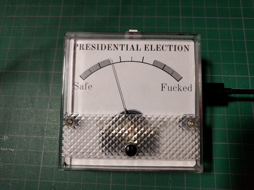

The Fuckedometer
================

Please see <a href="http://fuckedometer.com">Fuckedometer.com</a> for more details.

How fucked are we likely to be? This open source wifi-enabled IoT device tells
you all you need to know about the upcoming presidential election. Keep it by
your desk as a gentle reminder that (at least as of this writing) things are
not yet as fucked as they could be.

[Watch it in action!](https://www.youtube.com/watch?v=CyeYWI34pMM)

The data come from [PredictWise](http://predictwise.com/) and show the
predicted outcome of [the 2016 presidential election](http://predictwise.com/politics/2016-president-winner).

Usage
-----

When you first turn on your Fuckedometer, its status light should be blinking
white. From your computer, connect to the `Fuckedometer` wifi access point.
When you are connected, open a web browser and visit

    http://192.168.4.1/

From there, follow the directions to select the appropriate access point and
enter your wifi password. The Fuckedometer will automatically connect to this
access point going forward.

Building One
------------

It's easy to build on of your own!

Ingredients
-----------

* 1 [Adafruit Feather Huzzah][huzzah]
* 1 [Adafruit 80mm P252 analog panel][meter]
* 1 66k resistor
* A printout of the included meter face
* 1 USB cord + charger

Optional

* 1 lipo battery
* Some double-stick foam tape to stick things together
* 1 APA102 (or similar) RGB LED to indicate Wifi status

Recipe
------

Flash the ESP8266 with software included in this repository. I used Platform.io
to compile it, but you should be able to use any number of tools fairly easily.

Connect the ground of the panel to the Huzzah's ground pin.

Connect the panel's positive lead to pin 5 on the Thing using the resistor in series.

Connect the APA102 to the Thing. APA102 Clock goes to SCK. APA102 Data goes to
Thing pin 13. APA102 Power goes to 3v and grounds to grounds.

Depending on the resistor size, you may need to modify `METER_MAX` so that it
ranges properly.

License
-------

The software in this repository is licensed under the [GPL version 3 (GPLv3)][gplv3].

The artwork in this repository is licensed under the [Creative Commons BY-SA 4.0][cc-by-sa] license.

Donkey image CC-BY Flickr user DonkeyHotey https://www.flickr.com/photos/donkeyhotey/6262125702

[huzzah]: https://www.adafruit.com/products/2821
[meter]: https://www.adafruit.com/products/252
[gplv3]: http://www.gnu.org/licenses/gpl-3.0.en.html
[cc-by-sa]: https://creativecommons.org/licenses/by-sa/4.0/

